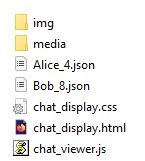

# Facebook-Messenger-JSON-viewer
If you've downloaded your Facebook data in JSON format, this tool lets you read the chats more intuitively.

Useful if you've deleted Facebook, but downloaded your JSON data. Or doing amateur forensics or manual evidence skimming of some sort.

Forked to support Messenger E2EE exports.

**TL;DR** [here's the link to try it out, with media files not working](https://xiangyann.github.io/Facebook-Messenger-JSON-viewer/chat_display.html)

## How to use

### Method 1
Online tool: [Facebook-Messenger-JSON-viewer](https://xiangyann.github.io/Facebook-Messenger-JSON-viewer/chat_display.html).

You can select your JSON files and all the data will be processed client-side so you don't have to worry about me reading your chats 😁

One thing to note is that it can't read the media files on your device, so it won't work there. If you prefer to have the function of images I recommend cloning the repo yourself!

### Method 2
#### Step 1
Clone this repo and run `chat_display.html` on your browser.

#### Step 2
Extract the files from your zip into the folder alongside the repo files.

If you see the img and media folder together, you're doing it right.

If you see messages folder beside img folder, you're doing it wrong.

Correct folder structure:

#### Step 3
After selecting your file, you'll be asked which participant you are.

This will put your messages on blue bubbles on the right side, and everyone else's messages on the left, in grey bubbles.

#### Step 4
Voilà, your chats can now be easily read.

Quick demo:

As raw JSON, it's hard to read and it's in reverse chronological order (pic is old, there is a new format but it works the same):

Using this Facebook Messenger JSON viewer, it looks much better:

## Ideas / TODO
* None
